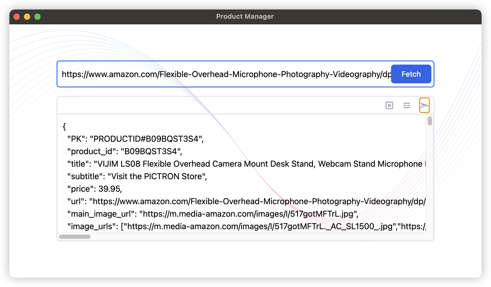
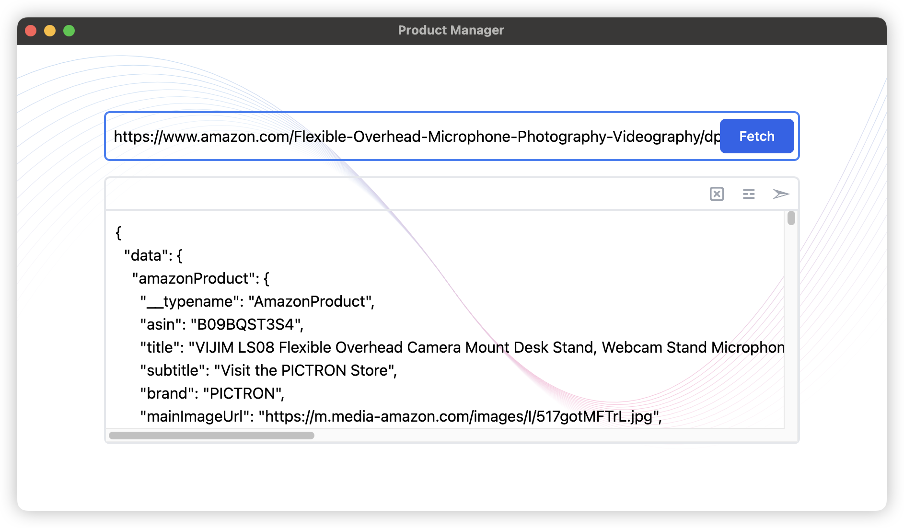

# Product-Manager

Product Manager is an Electron application built with React and TypeScript. It fetches product details from Amazon (by URL or ASIN), formats them and provides a quick way to prepare product records for insertion into a DynamoDB instance.

This README provides visuals of the app and covers how to install, run, build, and troubleshoot the project locally on macOS (zsh). It also documents project structure and common pitfalls.

## Visuals





## Quick links

- Main scripts: `npm run dev`, `npm run build`, `npm run start`
- Packaging uses: `electron-builder`

## Requirements

- Node.js (LTS recommended, v18+ works well)
- npm (comes with Node)
- macOS (this README focuses on macOS; CI/Windows/Linux builds are supported by scripts)

## Install

From the `product-manager` folder run:

```bash
npm ci
```

If you prefer, `npm install` works too, but `npm ci` gives deterministic installs when a lockfile is present.

## Development

Start the development server (Electron + Vite):

```bash
npm run dev
```

This runs `electron-vite dev`, which starts Vite for the renderer and runs Electron for the main process. The dev workflow supports live reload for renderer code and auto-reload for main/preload changes.

## Build / Package

Run a full typecheck and build:

```bash
npm run build
```

Platform-specific packaging (uses `electron-builder`):

```bash
# macOS
npm run build:mac

# Windows
npm run build:win

# Linux
npm run build:linux
```

The `postinstall` script runs `electron-builder install-app-deps` which prepares native dependencies for Electron.

## Project Structure (important files)

- `src/main` — Electron main process entry (`index.ts`).
- `src/preload` — Preload script types and implementation.
- `src/renderer` — React app (Vite) and renderer code.
- `package.json` — scripts, dependencies.
- `electron.vite.config.ts` — Vite + Electron config.
- `build/` — platform-specific packaging resources (icons, entitlements).

## Troubleshooting

1. electron-builder postinstall errors

	If you see errors like `./electron-builder/cli.js: No such file or directory` during `npm install` or `npm ci`, try:

	```bash
	# remove previous installs
	rm -rf node_modules package-lock.json
	npm cache clean --force

	# reinstall
	npm ci
	```

	If the error persists, ensure `electron-builder` is present in `devDependencies` in `package.json` and that your Node/npm versions are supported by the installed `electron-builder` version.

2. Dev server starts but app window is blank

	- Make sure `npm run dev` output shows both Vite and Electron started.
	- Check the terminal for renderer build errors (Vite). Fix TypeScript/React compile errors.


## Tips

- Use `npm run lint` and `npm run format` to keep code tidy.
- If you only need to rebuild renderer assets, run Vite tasks directly (via `electron-vite` helpers) to avoid rebuilding native deps.

## Example workflow (macOS zsh)

```bash
# from project root
cd product-manager

# fresh install
rm -rf node_modules package-lock.json
npm ci

# start dev
npm run dev

# open dev console logs and terminal output if something fails
```

## Where to look for issues

- Terminal where you ran `npm run dev` — contains build errors from Vite or Electron.
- Renderer devtools console (in the Electron window) — runtime JS errors.
- `~/.npm/_logs/` — npm logs for install/postinstall failures.

